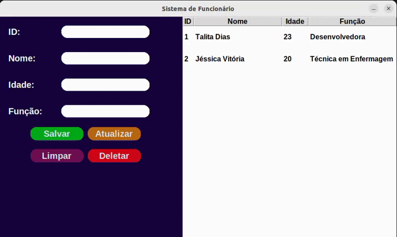
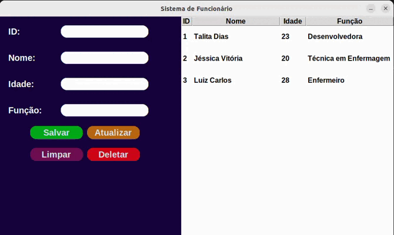

# CRUD Aplicação em Python

Bem-vindo ao projeto de aplicação CRUD em Python! Esta é uma aplicação básica que permite criar, ler, atualizar e excluir (CRUD) registros usando um banco de dados SQLite e uma interface gráfica com CustomTkinter e Tkinter.

## Recursos do Projeto
- Criação, leitura, atualização e exclusão de registros.
- Uso de SQLite para armazenamento de dados.
- Interface gráfica com CustomTkinter e Tkinter para uma experiência de usuário amigável.
- Estrutura de projeto simples e limpa para facilitar a compreensão e extensão.

### Criando Registro


### Atualizando e Deletando Registro


## Requisitos do Projeto
- Python 3.x
- Bibliotecas: `sqlite3`, `customtkinter`, `tkinter`

## Instalação
Para configurar o ambiente e executar a aplicação, siga estas etapas:

1. Clone o repositório para o seu ambiente local:
   ```bash
   git clone https://github.com/talitasdias/app_crud.git
   
3. Acesse a pasta do projeto:
   ```bash
   cd app_crud
   
5. (Opcional) Recomenda-se criar um ambiente virtual para instalar as dependências:
   ```bash
   python -m venv venv
   source venv/bin/activate  # Para Linux/macOS
   venv\Scripts\activate  # Para Windows

7. Instale as dependências necessárias:
   ```bash
   pip install customtkinter tkinter sqlite3
   
